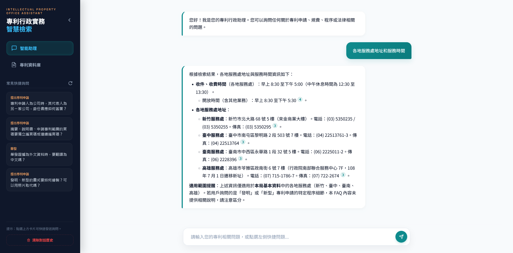
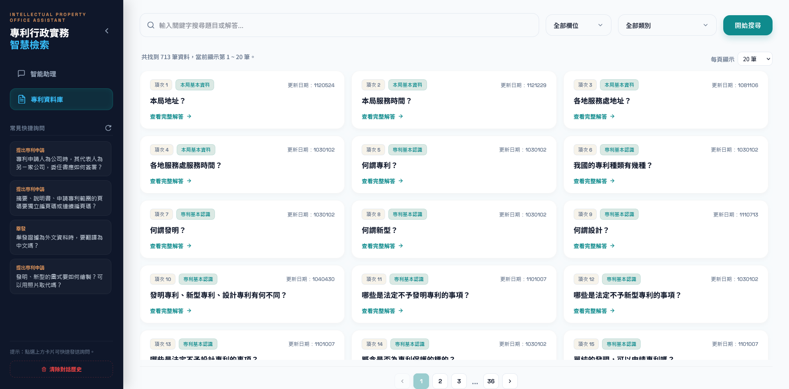

# 中華民國智慧財產局專利行政實務智能客服

基於混合檢索與 LLM 技術之專利問答系統，專為中華民國智慧財產局（TIPO）專利常見問答 (FAQ) 開放資料集打造。透過多層次防禦架構與雙代理人 (Dual-Agent) 審查機制，系統能精準解答專利法規問題，同時將 LLM 幻覺風險降至最低。




## 🌟 核心特色

- **支援口語化精準問答**：針對隨性的日常口語提問進行結構化轉譯，跨越日常用語與嚴謹法規之間的語意落差。
- **上下文記憶流暢對話**：系統具備短期歷史記憶，能處理省略句及代名詞（例如「那新型專利呢？」）。
- **雙代理人零幻覺防禦**：透過 Agent 1 嚴格防守「概念切合度」，及 Agent 2 確認「解答覆蓋範圍」，杜絕捏造法規期限與規費的問題。
- **附帶官方來源可溯源**：整合生成解答時，主動附上對應的 FAQ 官方條目連結，利於使用者進行二次查核。
- **高性價比本地部署**：藉由精細模型卸載策略與架構截斷優化，系統可於 6GB VRAM（如 RTX 2060）之消費級顯示卡順暢運作。

---

## 🏗 系統架構

本系統採用多層級防禦的混合檢索架構（Hybrid Search），核心防禦與檢索流程如下圖：

```mermaid
graph LR
    Start(["用戶輸入查詢"]) --> CacheCheck{"語意快取命中?<br>Exact / Sim >= 0.95"}
    CacheCheck -- Yes --> ReturnCache(["直接返回快取解答"])
    CacheCheck -- No --> Contextualize["對話歷史重寫 Contextualize Query"]
    Contextualize --> Extract["LLM 結構化關鍵詞提取"]
    Extract --> Compute["計算混合檢索候選條目<br>RRF + Fuzzy + BM25 + Keyword"]
    Compute --> BypassCheck{"符合 Bypass 雙門檻?"}
    BypassCheck -- Yes --> FormatStd["鎖定最佳條目"]
    BypassCheck -- No --> Rerank["CrossEncoder Reranker 重排"]
    
    Rerank --> Damping["一致性衰減 Damping 調整"]
    Damping --> Agent1{"Agent 1 概念切合度守門員"}
    
    Agent1 -- Yes --> Agent2{"Agent 2 覆蓋判斷員"}
    Agent1 -- No --> Rescue1["啟動 Alignment Rescue 救援"]
    
    Rescue1 -- Yes --> Agent2
    Agent2 -- Yes --> FormatStd
    Agent2 -- No --> Rescue2["啟動 Coverage Rescue 救援"]
    
    Rescue2 -- Yes --> FormatStd
    Rescue1 -- No --> RAG["降級：向量檢索 + RAG 生成"]
    Rescue2 -- No --> RAG
    
    FormatStd --> ReturnResult(["返回解答給用戶"])
    RAG --> ReturnResult
    
    style CacheCheck fill:#d1ecf1,stroke:#17a2b8,stroke-width:2px;
    style Agent1 fill:#fff3cd,stroke:#ffc107,stroke-width:2px;
    style Agent2 fill:#fff3cd,stroke:#ffc107,stroke-width:2px;
    style Rescue1 fill:#d4edda,stroke:#28a745,stroke-width:2px;
    style Rescue2 fill:#d4edda,stroke:#28a745,stroke-width:2px;
    style RAG fill:#f8d7da,stroke:#dc3545,stroke-width:2px;
```



---

## 🛠 技術棧與環境需求

- **後端框架**：Python 3.10+, Flask 3.0
- **資料庫**：SQLite3 (Session 與 Semantic Cache)
- **檢索引擎**：`sentence-transformers`, `rapidfuzz`, `jieba`
- **本地 LLM 伺服器**：LM Studio (提供 OpenAI 兼容 API, 預設為 `localhost:1234`)
- **硬體需求**：至少 6GB VRAM (NVIDIA GPU) 搭配 16GB 系統記憶體

### 模型規劃

1. **LLM 代理與推理**：`qwen3.5-4b` GGUF (Q4_K_M)
2. **向量檢索**：`text-embedding-bge-m3` FP16
3. **CrossEncoder 重排**：`BAAI/bge-reranker-v2-m3` FP16

---

## 🚀 安裝與部署指南

### 1. 安裝依賴套件

請確認已安裝 Python 3.10 以上版本，並於終端機執行：

```bash
pip install -r requirements.txt
```

### 2. 準備 LM Studio 及下載模型

1. 下載並安裝 [LM Studio](https://lmstudio.ai/)。
2. 開啟 LM Studio，進入 Search 頁面下載以下模型：
   - `Qwen/Qwen1.5-4B-Chat-GGUF` (或 Qwen 3.5 4B 相容模型)
   - `BAAI/bge-m3` 的 Embedding 模型 
3. 在 LM Studio 進入 **Local Server** 頁面：
   - 掛載 Qwen 4B 模型。
   - 開啟 **Text Embeddings**，並掛載 `bge-m3` 模型。
   - 點擊 **Start Server**。預設網址為 `http://localhost:1234/v1`。

### 3. 設定環境變數 (.env)

在專案根目錄下會有 `.env` 檔案，請依需求設定以下環境變數。若無特殊需求，可維持空白：

```ini
# LINE Bot 設定 (如需串接 LINE，請填寫)
LINE_CHANNEL_ACCESS_TOKEN=your_access_token_here
LINE_CHANNEL_SECRET=your_channel_secret_here

# Flask 啟動 Port (預設 5000)
PORT=5000
```

### 4. 啟動服務

啟動後端主程式：

```bash
python app.py
```

服務啟動後：
- 終端機將顯示：`Running on all addresses (0.0.0.0)`
- 開啟瀏覽器進入 `http://localhost:5000` 即可訪問網頁版 Web UI 介面。
- 若設定了 LINE 變數，可將 Webhook URL 指向您的 `https://<your-domain>/callback`。

### 5. LINE Bot 對話重置

在 LINE 對話中輸入 `/reset`，可以清除目前使用者的對話歷史並開始新對話。

系統只會刪除該使用者的 sessions 歷史，不會影響 FAQ 資料或語意快取。

---

## 📄 授權與開源聲明

- 專利 FAQ 資料集源自 [政府資料開放平臺 (資料集編號：16414)](https://data.gov.tw/dataset/16414)。
- 本專案採用開源授權釋出，歡迎 Fork 及貢獻！
