# 中華民國智慧財產局專利行政實務智能客服
## 開放平台軟體 期末專題書面報告

---

### 摘要

本專題採用中華民國智慧財產局（TIPO）「專利常見問答 FAQ」開放資料集，建構具備深度語意理解、抗幻覺且高精確度的混合檢索與大語言模型（LLM）智能客服。技術核心融合多通道特徵（涵蓋 BM25、BGE-M3 向量與字面比對）及 RRF 分數標準化，同時導入 `BAAI/bge-reranker-v2-m3` CrossEncoder 執行精確重排。為強化後置防禦，我們開發雙代理人（Dual-Agent）架構，嚴密檢驗概念切合度與答案覆蓋範圍。實證數據指出，系統於全量基準測試締造 100.00% 檢索召回率；面對兩組高難度的口語抗擾測驗，依然維持極高精準度，成功消弭日常口語與嚴謹法規間的語意落差。

---

### 一、 基本資訊與專題題目

*   **第幾組**：[6/10 第12組]
*   **小組成員學號姓名**：
    *   [1111452 葉子羿]
*   **專題題目**：**基於混合檢索與 LLM 技術之智能客服系統**  

---

### 二、 專題背景

#### 1. 研究背景
專利申請牽涉繁複的《專利法》與行政規範，條文不僅細緻，更具備優先權、優惠期等嚴格的法定時效。當發明人或基層法務人員遭遇實務疑難，多半仰賴官方 FAQ 尋找解答。為此，本專題介接政府資料開放平臺的[經濟部智慧財產局專利常見問答 FAQ（資料集編號：16414）](https://data.gov.tw/dataset/16414)，運用其內含 713 條涵蓋問題、解答及專利類別等欄位的知識庫作為底層基礎。

專利法務資訊容不下任何模糊空間。一旦問答系統給出錯誤、張冠李戴的指引（例如誤將「設計專利」期限套用於「發明專利」），申請人極可能面臨「不予受理」或「喪失權利」的嚴重後果。

#### 2. 系統核心功能
為了提供更優質的專利問答服務，本專題從使用者體驗出發，提供以下核心功能：
*   **支援口語化精準問答**：使用者無需硬背艱澀的法律專有名詞，即使使用日常口語化提問（如「寫錯字怎麼改」代替「誤記訂正」），系統依然能精準理解並給出正確的法規解答。
*   **具備上下文記憶的流暢對話**：系統能記住前因後果，使用者可以自然地使用代名詞（如「那發明專利呢？」）進行連續追問，無需每次都重複完整的問題背景，且系統回應極為迅速。
*   **零幻覺的安全法規指引**：針對專利法規嚴格把關，杜絕 AI 常見的胡編亂造，確保提供的期限、規費與程序指引絕對準確，保護使用者的專利權益不受損害。
*   **附帶官方來源的統整性回覆**：面對複雜問題，系統會自動彙整多篇官方 FAQ 提供完整詳盡的解答，並在文末附上明確的參考來源連結，讓使用者能安心進行二次查證。
*   **多元友善的前端介面支援**：除了提供原生 SPA 網頁架構之外，系統亦整合 LINE BOT，讓使用者能透過最熟悉的通訊軟體，隨時隨地取得專利諮詢服務，大幅降低使用門檻。

---

### 三、 系統架構與特徵融合演算法

本系統打造多層級防禦的混合檢索架構，其技術精髓在於多維度特徵融合搭配 RRF 排名正規化。

#### 1. RRF (Reciprocal Rank Fusion) 特徵融合與量綱對齊
為避免向量語意與 BM25 詞頻特徵出現權重失衡，系統採用 RRF 演算法將雙邊排名轉換為標準化分數。公式定義如下：
$$RRF_{score} = \frac{1}{60 + Rank_{vector}} + \frac{1}{60 + Rank_{bm25}}$$
隨後將其映射至百分制：
$$RRF_{normalized} = \left( \frac{RRF_{score}}{0.03278} \right) \times 100$$

#### 2. 綜合評分公式
綜合檢索分數結合了快速模糊比對、關鍵詞權重，以及針對解答特徵設計的專屬獎勵機制。各項特徵權重均透過前導測試集進行經驗參數微調而確立：
$$TotalScore = 0.2 \cdot S_{rrf} + 0.5 \cdot S_{vector} + 0.25 \cdot S_{fuzzy} + 0.1 \cdot S_{bm25\_rank\_score} + 0.25 \cdot S_{primary\_kw} + 0.05 \cdot S_{secondary\_kw} + \sum (W_i \cdot Bonus_i)$$

*   **$\sum (W_i \cdot Bonus_i)$ 獎勵與補償項定義**：
    *   **$W_1 \cdot Bonus_{hit}$**：關鍵詞命中次數 ($HitCount$) 的基礎加權。
    *   **$W_2 \cdot Bonus_{primary\_exact}$**：主關鍵字於題目中精確命中之極大獎勵（實證權重 $W_2 = 3.0$）。
    *   **$W_3 \cdot Bonus_{answer\_hit}$**：答案命中獎勵。若 LLM 提取的關鍵詞屬於答案特徵（例如詢問種類時提取出「設計」），且未見於短題目中，只要答案文本包含該詞，即賦予實證權重 $W_3 = 1.5$ 的加分。
    *   **$W_4 \cdot Bonus_{length\_comp}$**：長度補償。面對 $\le 15$ 字的極短提問，只要字元重疊率達標，系統便提供最高 $12.0$ 分的補償，避免短提問被長句的特徵分數所淹沒。

#### 3. 權重設計與特徵重疊之實證考量
為維護評分機制的邏輯嚴謹性，計分公式導入兩項關鍵設計：
*   **非機率型的啟發式總和 ($> 1.0$)**：綜合公式基礎權重總和設為 $1.35$ ($0.2+0.5+0.25+0.1+0.25+0.05$)。這並非傳統機率模型，而是刻意在混合特徵下利用超過 1.0 的加權極化得分差距，確保後續 Bypass 雙門檻能清晰劃分高低分群。
*   **獨立保留 BM25 線性分數的必要性**：儘管 RRF 已經涵蓋 BM25 排名資訊，系統依然額外疊加 $0.1 \times S_{bm25\_rank\_score}$。此舉旨在彌補 RRF 非線性倒數排名 ($1/(60+rank)$) 容易抹平前幾名分數落差的副作用。當使用者提問對專利實體關鍵字達成字面精確命中 (Exact Match) 時，這項設計能完整守住 BM25 絕對第一名的線性分數優勢，防止其被向量檢索中僅是「語意擦邊」卻缺乏字面交集的高分項目意外超車。

---

### 四、 核心防禦與檢索機制

#### 1. 雙層語意快取
系統於 `app.py` 實作 SQLite 持久化快取及對話歷史追蹤機制：
*   **Layer 1 (精確匹配)**：針對用戶查詢執行 SHA-256 雜湊運算，若完全吻合則直接回傳解答。
*   **Layer 2 (語意匹配)**：計算用戶輸入的 Embedding 向量，並與歷史快取向量展開 Cosine Similarity 比對；當相似度 $\ge 0.95$ 即直接沿用歷史回覆。

#### 2. 獨立問題重寫
*   當附帶對話歷史的提問進入系統，LLM 會主動把代名詞或省略句重構為不依賴上下文的「獨立完整提問」，徹底消除指代不明的困擾。

#### 3. 結構化關鍵字提取與三通道混合檢索
進入初篩階段時，系統先交由 LLM 萃取關鍵字，隨即同步展開三條通道的廣泛檢索，綜合計算出 Top-12 候選清單：
*   **結構化關鍵字提取**：調用 `qwen3.5-4b` 強制將隨性的口語提問對齊至「法定術語」，作為後續檢索計分的加分籌碼。
*   **向量語意檢索**：透過 `text-embedding-bge-m3` 測算提問與 FAQ 題目及延伸問題的餘弦相似度，並引入「多向量最大相似度 (MAX)」設計，強行跨越口語與法規間的語意鴻溝。
*   **詞頻檢索 (BM25)**：運用 `jieba` 分詞計算 TF-IDF 的變體 BM25 分數，確保核心實體詞彙無縫接軌。
*   **字面模糊比對 (Fuzzy)**：針對極短提問或特定錯別字，借助 `rapidfuzz` 估算字元級距相似度，構築最堅實的兜底防線。

#### 4. Bypass 雙峰警戒水位門檻
將 Top-12 送入 Reranker 前，系統會啟動極限效能優化的 Bypass 檢測：
若第一名與第二名候選的積分差距 $\ge 8.0$（具備絕對優勢），且第二名分數 $< 75.0$（未達雙峰競爭警戒水位），即認定初篩結果具備極高可信度。這兩個源自分數分佈變異數的動態閾值，能精準挑出毫無懸念的優勢解答。系統此時會鎖定第一名並跳過後續重排與代理人審核（對應圖表 Bypass Check），大幅削減運算延遲。

#### 5. CrossEncoder 深度重排 (Reranking)
凡未能跨越 Bypass 門檻的 Top-12 條目，系統將呼叫本地 `BAAI/bge-reranker-v2-m3` 模型執行字級深度交互注意力運算。其 Logit 輸出會經由 Sigmoid 轉換成 0-100 的百分制分數，再與初階檢索得分以 50:50 權重進行加總。

#### 6. 雙代理人審查與雙重救援機制
輕量級 LLM（如 4B 模型）因參數規模與注意力上限，極難在單一 Prompt 中同步處理「法規主體核對」與「細節覆蓋度盤點」等多重複雜任務。為突破此一瓶頸，系統捨棄傳統單次審查，改採分而治之的串列式多代理人 (Multi-Agent) 架構。此舉不僅翻倍提升模型的指令遵循力與審核精準度，Agent 2 所盤點出的「缺口 (Coverage Gap)」更化身為驅動後續 RAG 生成的關鍵樞紐。
在這套雙代理人審核流程中，系統緊密鑲嵌了雙重救援機制，嚴防錯殺任何高分候選：
*   **Agent 1 (概念切合度)**：針對專利類型、關係人角色與程序種類執行「反誤殺優先」的嚴密核對。倘若出現無法調和的法律矛盾，即判定為 Misalignment。
    *   **Rescue 1 (Alignment Rescue)**：一旦遭 Agent 1 否決，系統會立刻提拔「原始向量檢索 Top-1」與「LLM 重排 Top-1」作為替補，重新送交 Agent 1 補考切合度。
*   **Agent 2 (覆蓋度與 RAG 守門員)**：若 Agent 1 (或 Rescue 1) 亮綠燈放行，Agent 2 接著檢視該 FAQ 是否毫無死角地涵蓋用戶詢問的所有邊緣細節（如期限、罰則等）。若查有缺漏，則具體記錄缺口 (Coverage Gap) 以供 RAG 運用。
    *   **Rescue 2 (Coverage Rescue)**：若 Agent 2 認定覆蓋度欠佳，系統同樣會測試替補選手是否具備更完整的涵蓋範圍。

#### 7. RAG 1對多補足方案與通用降級防線
前述雙代理人檢索及救援迴圈皆屬「單一問題對應單一 FAQ」的精準打擊。唯有所有救援全數落空（即遍尋不著能 100% 覆蓋提問的單一 FAQ），流程才會切入最終防線：
*   **RAG 向量整合生成 (1對多補足方案)**：系統仰賴 `text-embedding-bge-m3` 抓取向量相似度 $\ge 0.45$ 的 Top-5 候選 FAQ 組裝成上下文區塊，並以嚴格的 System Prompt 要求 `qwen3.5-4b` 模型「僅能依據提供資料作答，嚴禁捏造幻覺」。模型會根據 Agent 2 留下的缺口進行綜合補足，同時強制在參考段落句末標示引用來源標籤 (`[#ID]`)，以利前端生成 SVG 查證連結，鞏固資訊可溯源性。
*   **通用回答 (最終降級方案)**：若連 RAG 都無法拼湊出充足的法規資訊，系統便會退守真正的降級防線，提供不具法律風險的標準回覆，並指引使用者直接致電智慧局窗口洽詢。

---

### 五、 開發技術棧與硬體部署環境

在 AMD Ryzen 7 3700X 搭配 RTX 2060 (6GB VRAM) 的硬體環境下依然運行順暢：

*   **後端與資料庫**：Python 3.10+, Flask 3.0, SQLite3（專司 Session 與語意快取）。
*   **本地推理伺服器**：運用 LM Studio 統一掛載 `qwen3.5-4b` 及 `text-embedding-bge-m3`，對內發布相容 OpenAI 的標準化 API (`localhost:1234`)，徹底實現 Flask 後端與 AI 推理模組的解耦。
*   **檢索引擎**：`PyTorch`（餘弦矩陣運算）, `sentence-transformers`, `rapidfuzz`（字面匹配）, 繁體 `jieba` (BM25)。
*   **前端介面**：原生 SPA 架構，支援 Glassmorphism 磨砂玻璃視覺、非同步載入骨架屏及側邊欄折疊持久化。

#### 模型輕量化與 VRAM 極致優化分布
為實現一般個人電腦皆可負擔的低成本建置，我們精選三款強悍且極度輕量的模型。搭配精準調校 LM Studio 的上下文限制與 GPU 卸載層數，系統成功在 6GB VRAM 級別的消費級顯卡上流暢運作：
1.  **LLM 代理與推理 (`qwen3.5-4b` GGUF Q4_K_M)**：憑藉 LM Studio 高效載入（上下文長度設為 16,384、GPU 卸載 32 層），記憶體佔用約 4.08 GB。
2.  **向量檢索 (`text-embedding-bge-m3` FP16)**：藉由 LM Studio 載入超輕量 Embedding（568M 參數，上下文長度設為 8,192、GPU 卸載 24 層），佔用約 1.16 GB。
3.  **CrossEncoder 重排 (`BAAI/bge-reranker-v2-m3` FP16)**：超輕量重排模型（568M 參數，並於程式碼層級設定 `max_length=1024` 截斷優化），同樣佔用約 1.16 GB。

模型靜態總和約 6.40 GB。在 6GB VRAM環境下，這微幅溢出的 0.4GB，系統純靠 PyTorch 原生的共享記憶體 (Shared Memory / CPU Offloading) 即可輕鬆弭平。這不僅印證了極低成本達成極高準確率的可行性，再配合 `batch_size=1` 與 `max_length=1024` 的 Reranker 截斷優化，更確保系統不對一般 PC 造成龐大運算負荷，便能順利跑完完整的後置驗證防禦架構。

#### 推論一致性與動態溫度策略
為擔保測試數據具備絕對的可重現性，系統於程式碼與推理伺服器端全域綁定 `seed=42`。針對不同層級的代理人任務，則精心規劃「動態溫度策略」，在嚴謹度與生成流暢性之間取得完美平衡：
1.  **防禦審查 (`temperature=0.0`)**：在「關鍵字提取」與「雙代理人法規審查」等核心防線，強制將溫度歸零，徹底抹除幻覺空間，確保邏輯推理絕對收斂。
2.  **RAG 綜合生成 (`temperature=0.2`)**：賦予極低隨機性，讓模型嚴守 FAQ 參考文本的邊界，順暢揉合出具備高可讀性的精準解答。
3.  **通用知識降級 (`temperature=0.7`)**：於缺乏檢索結果的最終防線適度鬆綁，允許模型以通用法理給予自然、具指引性的回覆。

#### 前端介面與使用者體驗設計
為了提供與底層強大 LLM 相匹配的高質感體驗，本系統的前端網頁 (Web UI) 深度打磨了各項 UX 細節：
1.  **原生 SPA 雙視圖切換**：採用單頁應用程式架構，使用者可於「智能助理」與「專利資料庫」兩個視圖間無縫切換，過程無需重新載入網頁，實現極致流暢的操作體感。
2.  **現代化視覺與動態互動**：介面導入 Glassmorphism (磨砂玻璃) 設計與精細的 CSS 轉場動畫。結合可折疊側邊欄與「快捷隨機問題」探索區，引導使用者快速上手系統。
3.  **非同步回饋與骨架屏**：針對檢索與生成的高延遲特性，前端實作了打字機指示器 (Typing Indicator) 與資料庫查詢的骨架屏 (Skeleton Screen) 動畫，大幅降低使用者的等待焦慮。
4.  **安全渲染防護**：考量到 LLM 回應的 Markdown 文本可能具備渲染風險，前端強制掛載 DOMPurify 進行 XSS 過濾，徹底守護客戶端的資訊安全。

---

### 六、 總體系統控制流圖 (程式流程圖)

系統處理查詢的決策樹與代理人分流邏輯圖如下 (Mermaid)：

```mermaid
graph LR
    Start(["用戶輸入查詢"]) --> CacheCheck{"語意快取命中?<br>Exact / Sim >= 0.95"}
    CacheCheck -- Yes --> ReturnCache(["直接返回快取解答"])
    CacheCheck -- No --> Contextualize["對話歷史重寫 Contextualize Query"]
    Contextualize --> Extract["LLM 結構化關鍵詞提取"]
    Extract --> Compute["計算混合檢索候選條目<br>RRF + Fuzzy + BM25 + Keyword"]
    Compute --> BypassCheck{"符合 Bypass 雙門檻?"}
    BypassCheck -- Yes --> FormatStd["鎖定最佳條目"]
    BypassCheck -- No --> Rerank["CrossEncoder Reranker 重排"]
    
    Rerank --> Damping["一致性衰減 Damping 調整"]
    Damping --> Agent1{"Agent 1 概念切合度守門員"}
    
    Agent1 -- Yes --> Agent2{"Agent 2 覆蓋判斷員"}
    Agent1 -- No --> Rescue1["啟動 Alignment Rescue 救援"]
    
    Rescue1 -- Yes --> Agent2
    Agent2 -- Yes --> FormatStd
    Agent2 -- No --> Rescue2["啟動 Coverage Rescue 救援"]
    
    Rescue2 -- Yes --> FormatStd
    Rescue1 -- No --> RAG["降級：向量檢索 + RAG 生成"]
    Rescue2 -- No --> RAG
    
    FormatStd --> ReturnResult(["返回解答給用戶"])
    RAG --> ReturnResult
    
    style CacheCheck fill:#d1ecf1,stroke:#17a2b8,stroke-width:2px;
    style Agent1 fill:#fff3cd,stroke:#ffc107,stroke-width:2px;
    style Agent2 fill:#fff3cd,stroke:#ffc107,stroke-width:2px;
    style Rescue1 fill:#d4edda,stroke:#28a745,stroke-width:2px;
    style Rescue2 fill:#d4edda,stroke:#28a745,stroke-width:2px;
    style RAG fill:#f8d7da,stroke:#dc3545,stroke-width:2px;
```

**圖一：混合檢索與雙代理人審查控制流圖。**

---

### 七、 實證成果與深度錯誤個案研究

#### 1. 測試數據與指標
知識庫基於 713 條官方專利 FAQ。為全方位驗證系統穩健性，本專題量身打造三階漸進式測試集：
*   **第一階 (精確基準)**：測試系統對原始 FAQ 題目的完美召回能力。
*   **第二階 (口語抗擾 A)**：檢驗一般用戶日常提問情境下的語意抗干擾度。
*   **第三階 (高難度變異 B)**：探測極端縮寫、語意模糊下的極限抗壓門檻。

**表一：三階漸進式測試集效能評估結果。**

| 測試集類型 | 測試問題來源 | 總測試題數 | 不匹配件數 | 命中率 |
| :--- | :--- | :---: | :---: | :---: |
| **精確基準測試集** | 原始 FAQ 問題 | 713 | 0 | **100.00%** |
| **口語抗擾測試集 A** | AI 基礎口語改寫 (`repara_faq_mismatch.csv`) | 713 | 8 | **98.88%** |
| **高難度變異測試集 B**| AI 高階變異改寫 (`repara_faq_mismatch_1.csv`)| 713 | 36 | **94.95%** |

#### 2. 深度錯誤個案剖析
為挖掘系統極限，我們從測試集 A 抽取出具備代表性的 Agent 行為錯誤案例展開剖析：

##### 案例一：Agent 1 (概念切合度守門員) 過度嚴格的邏輯判定
*   **用戶提問**：`「一案兩請中的『相同創作』是指全部請求項都要相同嗎？」`
*   **預期 FAQ (ID 177)**：`「一案兩請所謂的『相同創作』，是指申請專利範圍全部相同嗎？」` / 答案：`「是指申請專利範圍其中一項相同即可。」`
*   **系統反應**：Agent 1 判定為 Misalignment（不切合），直接導致錯失正確答案。
*   **剖析**：即使 Agent 1 的系統提示詞已清楚寫明「絕對性提問 vs 條件式答案 ≠ 不切合」，此案例依舊凸顯了輕量級 LLM 無法完美駕馭複雜 System Prompt 限制的困境。模型固執地將用戶提問的「全部相同」與解答的「其中一項相同」視為無法調和的事實衝突，錯誤否決了正確條目，完全印證了前述的「邏輯混淆」痛點。
*   **改進方向**：工程層面除了替換具備更強大推理能力的模型，亦可導入少樣本學習 (Few-shot prompting)，將這類邊界案例化為範本餵給 Agent；或是實作思維鏈 (Chain-of-Thought, CoT) 機制，強迫 Agent先給出針對「條件式答案」的推導步驟再下定論，藉此突破輕量模型指令遵循的極限。

##### 案例二：Agent 2 (覆蓋判斷員) 對聯絡方式的過度苛求觸發 RAG
*   **用戶提問**：`「『設計專利之優先權認定』新措施公告資訊可在哪裡查？」`
*   **預期 FAQ (ID 249)**：包含該新措施的法規實施日期與原則說明。
*   **系統反應**：檢索引擎與 CrossEncoder 皆以絕對高分精準命中，Agent 2 卻因 FAQ `「未提供官方洽詢電話或線上查詢系統操作」`，判定覆蓋度不彰，直接將其降級送入 RAG 生成。
*   **剖析**：用戶口語中的「哪裡查」意外勾起了 Agent 2 對聯絡管道的期待。明明 FAQ 內文已備妥詳盡的政策資訊，Agent 2 卻死板地因找不到網址而判定資訊缺漏。這曝露了輕量級 LLM 在執行「反過度推斷」指令上的短板，極易受模型內在的幻覺與不確定性干擾而擅自拉高審查標準。即便 RAG 模組最終依憑該文獻給出了完美解答 (Rescue Passed)，卻也徒增了無謂的 LLM 運算開銷。
*   **改進方向**：與案例一如出一轍，輕量模型常受預訓練常識蒙蔽而產生幻覺。治本之道同樣是升級模型，而在架構面上則可針對 Agent 2 植入 CoT 推理，強制其在判定「覆蓋度不足」前，必須逐一條列「題目要求卻未涵蓋的具體實體」，用拆解步驟的方式來鎖死模型的過度推斷行為。

---

### 八、 結論

本專題成功打造出具備高精確度、高穩健性與低成本建置優勢的專利行政 FAQ 智慧檢索系統。藉由導入 CrossEncoder 重排、RRF 特徵融合及創新的 Agent 1/2 雙代理人審查架構，這套系統有效撫平了傳統檢索的語意鴻溝並避開意圖錯置風險。同時，巧妙運用雙重救援機制與 SQLite 語意快取，在死守資料隱私、確保回應效能與維持低成本本地部署的前提下，將整體的抗擾能力推升至全新境界。

面對高難度變異的口語抗擾測試，系統在輕量級 LLM 參數與推理能力的雙重先天限制下，依然繳出 94.95% 至 98.88% 的高命中率，徹底展現多層級防禦架構在工業級落地的實戰價值。展望未來，若能將底層推理核心全線升級至更高階的大語言模型，此架構在邏輯守門與防範過度推斷的潛力勢必能全面釋放，穩步朝向專利法規問答「零失誤」的終極願景邁進。

---

### 九、 團隊貢獻與心得感想

#### 1. 參與事務及其貢獻
> *   **葉子羿**：[建構系統前後端、撰寫書面及上台報告]

#### 2. 遇到問題及如何解決
*   **困難一：口語表述與專業法律術語的「語意鴻溝」**
    *   **遇到的問題**：民眾提問往往隨性且口語化，例如問及「寫錯字要怎麼改？」在法規中實為「誤記訂正」。當兩者缺乏字面交集，傳統檢索機制便會徹底失靈。
    *   **解決對策**：我們導入「多通道混合檢索」，整合向量語意 (BGE-M3)、詞頻 (BM25) 與字面模糊比對 (Fuzzy)，並利用 RRF 演算法融合分數，成功跨越日常口語與嚴謹法規間的落差。

*   **困難二：輕量級 LLM 的「意圖錯置」與邏輯混淆**
    *   **遇到的問題**：為保護專利資料隱私並兼顧效能，本專題採用本地部署輕量級 LLM。然而，這類模型處理艱澀的專利法規時，極易混淆字面相近但法律效果迥異的專有名詞（如將「專利修正」與「專利更正」混為一談），導致指引方向完全錯誤。
    *   **解決對策**：我們開發了「雙代理人嚴密審查機制 (Dual-Agent)」。由 Agent 1 專門擔任概念切合度的守門員，強制模型核對「專利類型」、「關係人角色」與「程序種類」。只要出現法律邏輯矛盾便立刻擋下，成功防堵了意圖錯置的風險。

*   **困難三：輕量級 LLM 的「幻覺與不確定性」**
    *   **遇到的問題**：受限於模型參數規模，模型若缺乏強制的外部知識約束，極易憑空捏造法律期限或規費金額（即 AI 幻覺），在法務問答中這會造成嚴重的後果。
    *   **解決對策**：我們實作了「動態 RAG 生成與資訊溯源」架構，並將防禦審查節點的模型溫度 (`temperature`) 嚴格設為 0.0。強制模型只能依據檢索到的 FAQ 文獻作答，並規定必須於文末標示官方資料引用來源 (`[#ID]`)，藉此在「本地輕量部署」與「法規絕對精準度」之間取得完美平衡。

#### 3. 心得感想
這次專題製作讓我深刻體會到將大型語言模型（LLM）技術實際落地的各項挑戰。專題初期，我原先打算直接串接一般的 LLM API，卻很快發現免費額度完全無法支撐系統測試所需的龐大用量。為了解決成本問題，我轉而學習並成功在有限的硬體環境下部署了本地 LLM。

然而，改用本地模型後隨即面臨新的技術瓶頸：輕量級模型的指令遵循能力有限，無論怎麼調整 System Prompt，都很難讓模型精準跟蹤並處理複雜的法規邏輯。為了克服這點，我深入探究了 RAG 架構，才深刻體認到「資訊檢索」並不是一門簡單的學問。透過導入 RRF 特徵融合與雙代理人審查機制，系統終於能提供高品質的參考上下文，進而引導模型給出正確解答。

但是輕量本地 LLM 的能力也是很強大，這次的開發經驗不僅讓我見識到它在搭配精巧架構後所能展現的潛力，更讓我完整掌握了本地 LLM 部署與進階檢索工程的實戰技巧，整個克服困難的過程帶給我極大的成就感與技術啟發。